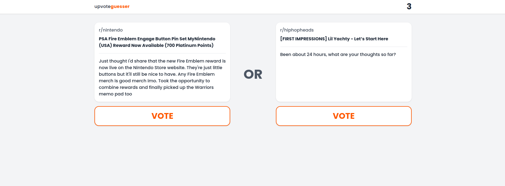

    </img>
    

    <h2 style="font-weight: bold">Upvote Guesser</h2>
    

* Built a Static Generation site through Next.js to save 100%+ on hosting fees.
* Utilized the Reddit API and built a function to fetch data from 100+ subreddits on a user click.
* Created a modern, responsive user interface on all screen sizes with media breakpoints and Tailwind CSS.

The live site is at [upvoteguesser.com](https://upvoteguesser.com/) 